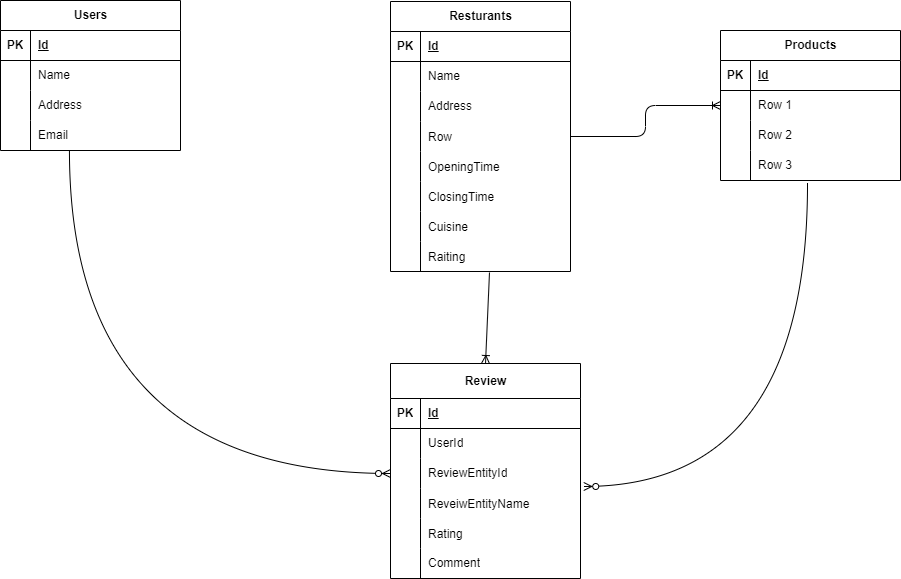

# User stories
1. As a user I can see the restaurants and their available products, each with the latest
review and the average rating, if they exist.
2. As a user I can rate and leave reviews for each restaurant and product.
3. As a user I can filter restaurants based on cuisine. (Optional)
4. As a user I can see all the restaurants I have rated in the past (Optional).

## Choice of tech stack
`Frontend` - React with MUI

`Backend` - Nestjs

## Database Design

A simple ER-Diagram for a simple task

